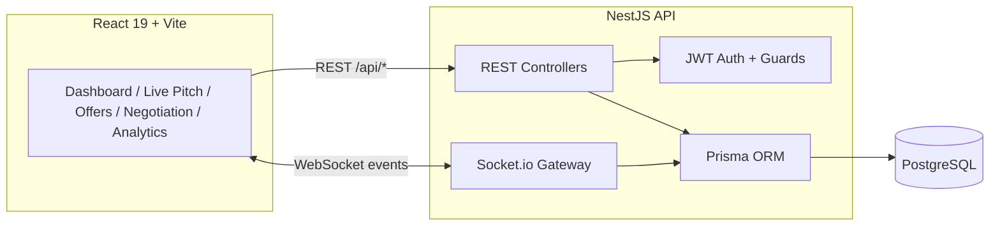
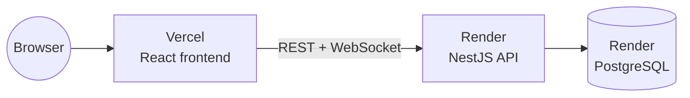

<div align="center">

# 🦈 Sharktank Simulator

**A real-time investment bidding platform — pitch, bid, negotiate, and close deals live.**

[](https://nestjs.com/)
[](https://react.dev/)
[](https://www.typescriptlang.org/)
[](https://www.postgresql.org/)
[](https://www.prisma.io/)
[](https://socket.io/)
[](https://www.docker.com/)
[](LICENSE)
[](https://sharktank-vert.vercel.app)

### 🔴 [**Try the live demo →**](https://sharktank-vert.vercel.app)

*Frontend on [Vercel](https://sharktank-vert.vercel.app) · API on [Render](https://sharktank-simulator-api.onrender.com/api/docs)*

[Quick Start](#-quick-start) · [Features](#-features) · [Architecture](#-architecture) · [API Docs](#-api-reference) · [Deployment](#-deployment)

</div>

---

## 🎯 What is this?

**Sharktank Simulator** recreates the energy of a live *Shark Tank* pitch event as a web app. Founders present startups, investors ("Sharks") compete with real-time offers, negotiations happen in a live deal room, and an **AI Deal Analyzer** scores every term sheet on the fly.

It's built for **startup incubators, university entrepreneurship programs, hackathons, and demo days** — anywhere you want a zero-friction, walk-up-and-play investment simulation.

> **No sign-up required.** Type any email address, use password `password123`, and you're in — a fresh investor account is provisioned instantly. See [Demo Login](#-demo-login).

---

## ✨ Features

<table>
<tr>
<td width="33%" valign="top">

### 👨‍💼 Admin
- Event creation & lifecycle control (start / pause / resume / end)
- Live pitch queue management
- Platform-wide broadcast announcements
- Activity log & audit trail
- Full user management

</td>
<td width="33%" valign="top">

### 🚀 Founder
- Startup profile & pitch deck management
- Live pitch queue join
- Real-time offers from multiple Sharks
- Counter-offers & negotiation room
- Deal timeline history

</td>
<td width="33%" valign="top">

### 🦈 Shark (Investor)
- Live event participation
- Submit / edit / withdraw offers
- Counter founder terms
- AI-assisted deal analysis
- Portfolio & deal history

</td>
</tr>
</table>

### 🌟 Signature features

| Feature | Description |
|---|---|
| 🎯 **Virtual Deal Table** | Founder at the center, Sharks around them — offers animate live between participants |
| 📜 **Live Deal Timeline** | Every offer, counter, and acceptance recorded to the second |
| 🤖 **AI Deal Analyzer** | Rules-engine that scores valuation multiple, dilution, risk, and suggests a counter |
| 📢 **Live Deal Ticker** | Bloomberg-style feed of offers, counters, and closed deals |
| 🎬 **Negotiation Focus Mode** | Dedicated 1-on-1 deal room with live chat and AI insights |
| ⏱️ **Live Pitch Timer** | Server-driven countdown broadcast to every connected client |

---

## 🏗️ Architecture



**Realtime events** cover the full deal lifecycle: `offer_created`, `offer_updated`, `offer_withdrawn`, `counter_offer_created`, `negotiation_started`, `chat_message`, `deal_accepted`, `deal_rejected`, `timeline_updated`, `notification_created`, `queue_updated`, `online_users`, `timer_updated`.

---

## 🛠️ Tech Stack

| Layer | Technology |
|---|---|
| **Frontend** | React 19, TypeScript, Vite, Tailwind CSS, Framer Motion, Recharts |
| **Backend** | NestJS 11, TypeScript, class-validator, Swagger (OpenAPI) |
| **Database** | PostgreSQL, Prisma ORM (migrations included) |
| **Realtime** | Socket.io (WebSocket gateway) |
| **Auth** | JWT access + refresh tokens, bcrypt, role-based guards |
| **DevOps** | Docker, Docker Compose, ESLint, Jest |

---

## 📂 Project Structure

```
sharktank-simulator/
├── src/
│   ├── components/         # React UI (Dashboard, LivePitch, Offers, Negotiation, Analytics...)
│   ├── lib/                 # api.ts (REST client), socket.ts (Socket.io client)
│   ├── server/               # NestJS backend
│   │   ├── auth/              # JWT auth, register/login/refresh
│   │   ├── users/ founders/ sharks/
│   │   ├── events/ startups/ pitch/    # Events, startup profiles, live pitch queue
│   │   ├── offers/ negotiations/ deals/
│   │   ├── notifications/ timeline/ admin/
│   │   ├── deal-analyzer/      # AI Deal Analyzer rules engine
│   │   ├── realtime/           # Socket.io gateway
│   │   ├── prisma/             # PrismaService/Module
│   │   └── common/             # Guards, decorators, filters, interceptors
│   └── App.tsx
├── prisma/
│   ├── schema.prisma          # Full data model (14 models)
│   ├── migrations/            # SQL migrations
│   └── seed.ts                 # Demo data seeder
├── test/                       # e2e tests
├── Dockerfile
├── docker-compose.yml
└── vite.config.ts
```

---

## 🚀 Quick Start

### Option 1 — Docker (recommended)

```bash
git clone https://github.com/Hunterq417/Shark-tank-simulator.git
cd Shark-tank-simulator
docker compose up --build
```

That's it. This spins up PostgreSQL + the built app in one container.

- App: **http://localhost:3000**
- API docs (Swagger): **http://localhost:3000/api/docs**

Seed demo data (startups, sharks, offers, deals):

```bash
npm install
npm run seed
```

### Option 2 — Local development

```bash
npm install
cp .env.example .env          # then point DATABASE_URL at your Postgres instance
npm run prisma:migrate
npm run seed
npm run dev                   # runs Vite (frontend) + Nest (backend) together
```

- Frontend dev server: **http://localhost:5173** (proxies `/api` and `/socket.io` to the backend)
- Backend: **http://localhost:3000**

### 🔑 Demo Login

No registration needed:

| Field | Value |
|---|---|
| **Email** | *any* email address — a new investor account is created on first login |
| **Password** | `password123` |

Or use any of the seeded accounts (founders, sharks, admin) — same password.

---

## ⚙️ Environment Variables

| Variable | Description | Default |
|---|---|---|
| `DATABASE_URL` | PostgreSQL connection string | — |
| `JWT_SECRET` | Access token signing secret | — |
| `JWT_EXPIRES_IN` | Access token lifetime | `1d` |
| `REFRESH_SECRET` | Refresh token signing secret | — |
| `REFRESH_EXPIRES_IN` | Refresh token lifetime | `7d` |
| `PORT` | Server port | `3000` |
| `CORS_ORIGIN` | Allowed CORS origin(s) | `*` |

See [.env.example](.env.example).

---

## 📊 API Reference

Full interactive OpenAPI/Swagger documentation is generated automatically and served at:

```
http://localhost:3000/api/docs
```

Covers all REST endpoints — auth, users, founders, sharks, events, startups, live pitch queue, offers, counter-offers, negotiations, deals, AI deal analyzer, notifications, timeline, and admin controls.

---

## 🧪 Testing

```bash
npm run lint          # type-check + ESLint
npm test               # unit tests (Jest)
npm run test:cov        # with coverage
npm run test:e2e        # end-to-end (requires a running database)
```

---

## 🐳 Deployment

This app runs in production as a **split deployment**:



### Frontend → Vercel

The frontend is a static Vite build — a natural fit for Vercel's edge network. [`vercel.json`](vercel.json) pins the build command and output directory:

```bash
npm i -g vercel
vercel link
vercel env add VITE_API_BASE_URL production   # e.g. https://your-api.onrender.com
vercel --prod
```

### Backend → Render

The API is a stateful NestJS server with persistent WebSocket connections, so it needs a platform that runs long-lived Node processes — not a serverless function. [`render.yaml`](render.yaml) is a Blueprint that provisions everything in one shot:

1. Render dashboard → **New → Blueprint** → select this repo
2. Render reads `render.yaml` and creates a managed **PostgreSQL** database plus a **Docker web service** built from the existing [`Dockerfile`](Dockerfile), with `DATABASE_URL` and JWT secrets wired automatically
3. Migrations (`prisma migrate deploy`) run automatically on every deploy, before the server starts

Any Node-process host works the same way (Railway, Fly.io, a VPS) — just point `DATABASE_URL` at a managed Postgres instance and set the JWT secrets as environment variables.

### Self-hosted (single container)

```bash
docker compose up --build -d
```

One container serves the built frontend, REST API, and Socket.io gateway together on one port, backed by a PostgreSQL container — the simplest option if you don't want a split deployment.

---

## 🔒 Security

- JWT access + refresh tokens (refresh tokens stored hashed)
- bcrypt password hashing
- Role-based route guards (`ADMIN` / `FOUNDER` / `SHARK`)
- Global validation pipes on every input
- Helmet HTTP headers, CORS configuration, request throttling

---

## 🤝 Contributing

1. Fork the repository
2. Create a feature branch: `git checkout -b feature/amazing-feature`
3. Commit your changes: `git commit -m "Add amazing feature"`
4. Push and open a Pull Request

---

## 📄 License

MIT — see [LICENSE](LICENSE) for details.

---

<div align="center">

**Built for founders, investors, and everyone who's ever wanted to sit at the deal table.**

⭐ Star this repo if you found it useful!

</div>
